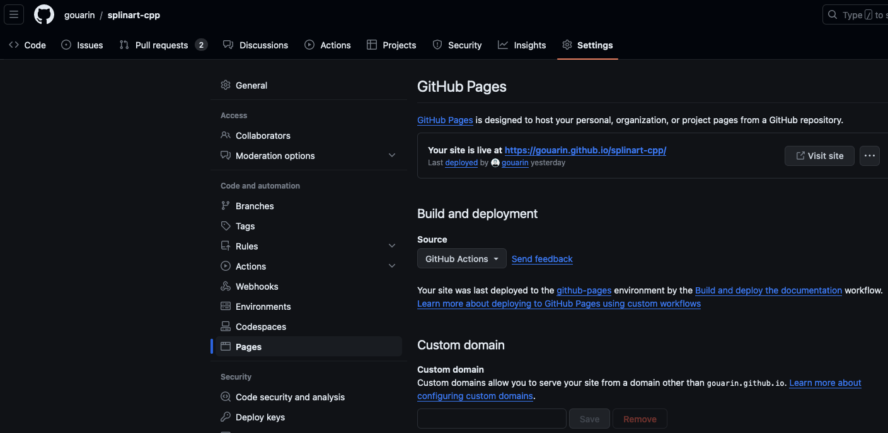

# Documentation

Nous allons à présent générer la documentation de notre logiciel et la rendre disponible via [GitHub Pages](https://pages.github.com/). Nous utiliserons [Sphinx](https://www.sphinx-doc.org), [breathe](https://breathe.readthedocs.io) et [doxygen](https://www.doxygen.nl/) pour générer la documentation en html. La configuration comporte un certain nombre d'étapes et nous ne souhaitons pas perdre de temps sur ce point. Nous avons néanmoins mis une partie à la fin de ce chapitre qui décrit les étapes si vous voulez le refaire plus tard.

:::{note}
N'oubliez pas de retourner dans la branche `main` et de faire

```bash
git pull
```
:::

Nous avons donc mis dans le répertoire `4.documentation/required_files` un répertoire `doc` qui contient la configuration et les fichiers markdown constituant la documentation. Il vous suffit de le copier dans votre répertoire.

Créez une nouvelle branche.

## Test local

Nous allons essayer de générer la documentation en local pour s'assurer que tout se passe correctement. Pour cela, nous avons ajouté une tâche dans le fichier `pixi.toml` qui fait la chose suivante

```toml
doc = { cmd = "cd doc; make html" }
```

Exécutez cette tâche et vérifiez que tout se passe bien.

:::{tip} html
Vous devriez avoir un dossier `html` qui s'est créé. Il vous suffit d'ouvrir dans votre navigateur le fichier `index.html`.
:::

## Mise en place de l'action

Nous allons ajouter une action pour la documentation dans le dossier `.github/workflows` que nous appelons `doc.yml`.

Écrivez l'action en vous appuyant sur ce que vous avez fait précédemment. Pour le moment, nous souhaitons juste faire ce que nous avons fait en local et mettre le répertoire `html` dans une archive : voir l'action [upload-pages-artifact](https://github.com/actions/upload-pages-artifact).

:::{tip} Artifact
A la foin de cette étape, vous devriez avoir accès à une archive en allant dans les actions de votre dépôt. Si vous téléchargez cette archive et que vous regardez ce qu'il y a dedans, vous devriez retrouver le contenu du répertoire `html`.
:::

## Configuration de GitHub Pages

Vous devez configurer GitHub Pages en allant dans les `Settings` de votre dépôt puis dans `Pages` et sélectionner pour les `Source` `GitHub Actions` comme sur cette image



Vous devez également ajouter dans votre fichier `doc.yml`, les lignes suivantes

```yaml
# Allow one concurrent deployment
concurrency:
  group: "pages"
  cancel-in-progress: true
```

Ceci afin d'éviter que plusieurs actions essaient de générer le site en même temps.

:::{note} Pour plus d'information
[Using concurrency](https://docs.github.com/en/actions/using-jobs/using-concurrency)
:::

## Mise en place de la documentation

